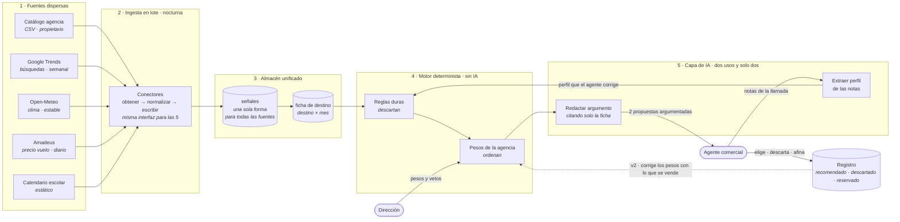

# Enfoque de arquitectura
**Entregable 4 del brief — componentes, herramientas y qué cambia en producción**

---

## 1. El principio que ordena el diagrama

Todo el sistema está construido sobre una separación:

> **La IA nunca decide. Descarta el código, ordenan los pesos de la agencia, y la IA solo lee texto libre y redacta.**

Si esa frase se entiende, el diagrama se entiende solo. Y responde de antemano a las dos preguntas que siempre llegan: *¿y si alucina?* (no puede: no elige) y *¿es reproducible?* (sí: mismo cliente y mismas reglas, misma respuesta).

---

## 2. El flujo

**Cómo se lee en voz alta, en tres frases**: por la izquierda entran cinco fuentes que no se parecen en nada y salen normalizadas a una sola forma. En el centro, cuando el agente pide algo, el código descarta y los pesos de la agencia ordenan — sin IA. Y solo al final, sobre las dos que quedan, la IA redacta el argumento con datos que ya estaban en la ficha.

---

## 3. Componentes y herramientas: hoy y mañana

La columna de la derecha es la que demuestra que sabes lo que separa una demo de un sistema que aguanta a cuarenta agentes.

| # | Componente | **Hoy (prueba de concepto)** | **Mañana (producción en el cliente)** | Por qué cambia |
|---|---|---|---|---|
| 1 | **Catálogo** | CSV de 30 experiencias cargado a mano | Conector al PMS/ERP de la agencia, sincronización continua | El catálogo real son miles de referencias que cambian a diario. Nadie sube un CSV |
| 2 | **Fuentes externas** | Trends, Open-Meteo, Amadeus (entorno de test) | Las mismas, en plan de pago con cuota garantizada. Amadeus o Travelgate para precios reales de la agencia | El entorno de test tiene datos parciales y límites de llamadas |
| 3 | **Ingesta** | Funciones programadas de Supabase + cron | Orquestador con reintentos, alertas y monitorización de frescura | Cuando una fuente falle a las 3 de la mañana alguien tiene que enterarse. Hoy no se entera nadie |
| 4 | **Almacén** | Postgres (Supabase) | Mismo Postgres. Almacén analítico solo si el volumen lo pide | **No cambia, y eso es una decisión, no una carencia.** Este problema no tiene volumen: son decenas de miles de filas |
| 5 | **Motor de reglas** | Función en TypeScript | Servicio versionado, con registro de qué versión de reglas generó cada recomendación | Auditoría. Dentro de un año habrá que explicar por qué se recomendó lo que se recomendó |
| 6 | **Capa de IA** | Una API de modelo de lenguaje, dos llamadas por recomendación | La misma, con modelo pequeño para extraer perfil, caché de argumentos y evaluación automática continua | Coste y control de calidad. Extraer un perfil no necesita el modelo caro |
| 7 | **Panel de la dirección** | Formulario de pesos y vetos | Lo mismo, con historial de cambios y permisos por rol | Alguien tiene que responder de haber subido el peso del margen |
| 8 | **Interfaz del agente** | Aplicación web propia | **Integrada en el CRM donde el agente ya trabaja** | Una herramienta más que abrir aparte es una herramienta que no se usa. La adopción se gana aquí |
| 9 | **Registro y bucle** | Tablas que guardan recomendado, descartado y afinado | Lo mismo + resultado real de reserva, alimentando el ajuste automático de pesos | Es la v2 del producto y el activo que hace que valga más cada mes |
| 10 | **Seguridad y datos** | Autenticación básica | Roles, trazabilidad, retención y anonimización de datos de cliente (RGPD) | Se están tratando datos personales de clientes reales |
| 11 | **Observabilidad** | La traza visible en pantalla | Métricas de latencia, coste por recomendación, frescura por fuente y deriva de la señal | Lo que no se mide, se degrada en silencio |

---

## 4. Las tres decisiones de arquitectura que hay que saber defender

**1 · Lote, no tiempo real.** El motor no llama nunca a una fuente externa. Compra latencia baja (el agente no espera), coste acotado (se paga por destino y día, no por consulta), reproducibilidad y resiliencia. Cuesta frescura: la señal de demanda puede tener hasta una semana. Para una decisión de "qué destino promover", una semana es irrelevante.

**2 · Una sola forma para todas las señales.** Cinco fuentes de naturaleza incompatible aterrizan en una tabla con la misma estructura: qué destino, qué mes, qué métrica, qué valor, de dónde, cuándo y en qué estado. Añadir una sexta fuente es escribir un conector, no tocar el motor. Cuesta un paso de normalización que hay que pensar por fuente.

**3 · La IA en dos sitios y solo dos.** Leer texto libre y redactar. Nada más. Cuesta flexibilidad ante matices que un modelo suelto captaría mejor, y lo compensa con que el sistema es auditable frase por frase: cada afirmación del argumento se puede rastrear a un campo de la ficha.

---

## 5. Lo que se degrada, no lo que se rompe

Ningún fallo externo tumba el producto:

| Si falla | Qué pasa |
|---|---|
| Precios de vuelo | Cae a la banda estática del catálogo, marcado como no disponible en la traza |
| Búsquedas | Se usa la última lectura y el peso de demanda baja según su antigüedad |
| Clima | Caché permanente, prácticamente no falla |
| Modelo de lenguaje | Se devuelven las 2 opciones con el argumento en formato plantilla, sin redacción |
| Catálogo | **Esto sí bloquea.** Es la única dependencia dura, y es interna |

La regla que lo unifica: **una señal que falta nunca se sustituye por un valor inventado.** Se reduce su peso y se marca. Rellenar huecos con supuestos es exactamente lo que produce recomendaciones que nadie sabe explicar.
